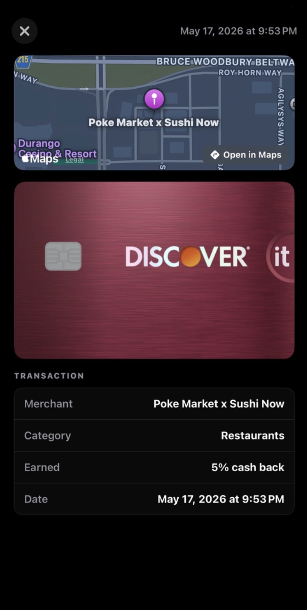
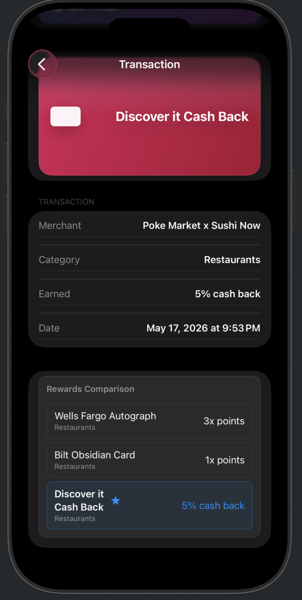
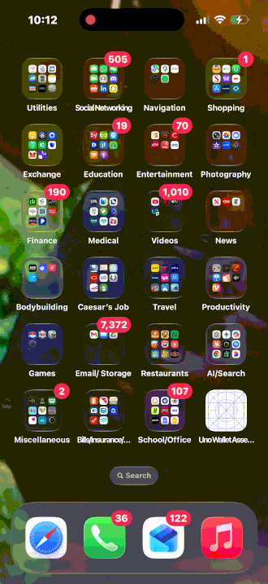

# Assessment - _Option B - New Feature_

Submitted by: **Shaun Sheffey**

**Decision Transparency: Rewards Comparison View**

## Summary

### Intro

My initial findings in testing the beta are that from the moment I open the application, it tracks my location and procures
a card for me to use for the purpose of optimizing my rewards. I am then transferred to Apple Wallet for a faceID scan
so that I can double tap the side button to allow for contactless payment. I close the application and move on with my
day. The next time I am ready to process another transaction, I open the uno wallet and the same process repeats. However,
after many iterations of this action I begin to wonder, "is this really selecting the credit card which will render optimal
rewards?"

### What the feature is and why it belongs in the product

The feature is Decision Transparency: Rewards Comparison View

This feature belongs in the app because users will not question the validity of the selection
process if they are provided a log which compares all possible rewards for a particular category
from their collection of credit cards.

### How you would implement it technically on iOS

v1 : The logic of credit card selection is already present within the application. So the moment the application selects the
winning card for optimal rewards means that it is ignoring the others. I would simply append a LazyVStack at the end of the
"Transaction" View Controller. Each row represents a credit card for that category and the
reward amount it produces. The winning category is highlighted and includes a star image to display the Uno Wallet selection.

v2 (hypothetical) : Apply for the utilization of FinanceKit framework to allow for the enrichment of rewards calculation data to
display to the user. We would then create a FinanceKitManager class to request transaction data from Apple Wallet explicitly for
transactions completed after Uno Wallet uses PassKit Web Service Handoff Webhook to complete purchases within Apple Wallet. This
would open the door for new features which could calculate reward amounts for each optimized rewards purchase. We would implement
a feature in "Settings" under "features" near "Lock Screen Recommendations" which we would call "Target SignUp Bonus". The toggle
subview would populate a picker (when toggled) to select the credit card and start date of the account. The backend would hold all
intro offer info as it does rewards info. Instead of selecting best rewards, we call a function target_signup_offer() that
essentially triggers the signup bonus offer card if the intro offer requirement amount (e.g. $2000 spend) hasn't been reached and
the intro period hasn't expired. Else, we return to standard reward selection protocol.

### Key tradeoffs or edge cases you considered

The tradeoff with this feature is it's pre Passkit Payment handoff. My goal was to implement a feature that would scrape data
from Apple Wallet and pass it back to Uno Wallet after the PKPaymentAuthorizationController is activated. However, iOS has
strict rules regarding Sandbox security protocols that don't allow for data to be transferred outside of Apple Wallet.
The PassKit handoff architecture is precisely what enables Uno Wallet to operate as a card optimization layer on top of Apple Wallet.
Since the application relinquishes control of the selected card's function after it is selected, Uno Wallet is not involved with the
payment process which means you avoid the process of financial legality and the inundation of paperwork required to be filed with banking
institutions. You also avoid costly partnerships and integration with financial and payment institutions such as Stripe or Plaid.

One edge case considered is if two cards have identical rewards, we select the card used less frequently. This allows a small balance
to accumulate on the less popular card which in extreme cases would negate the account closing if inactive for too long.

### What success looks like for this feature

The Rewards Comparison View (v1) relieves users' concerns of Uno Wallet's rewards optimization card selection. Instead of
telling people what they won, you tell them what they won in comparison to what they could have won--which is less.
This way, people feel impressed with their download and continue to use the application. Sure, some passive users won't care.
But for the users who are avid credit card churners, this feature will secure a slightly higher retention rate 6 months down
the road. For Finance Kit hypothetical (v2), the user retention rate for 6 month time horizon drastically improves as users
see a tracker of rewards compounded over time.

## Before & After

  

    
<strong>Existing Transaction Detail</strong>

    
  

  

    
<strong>Decision Transparency (proposed)</strong>

    
  

## Video Walkthrough

  

## Notes

Uno Wallet is a great idea which many credit card users will enjoy!

## License

    Copyright [2026] [Shaun Sheffey]

    Licensed under the Apache License, Version 2.0 (the "License");
    you may not use this file except in compliance with the License.
    You may obtain a copy of the License at

        http://www.apache.org/licenses/LICENSE-2.0

    Unless required by applicable law or agreed to in writing, software
    distributed under the License is distributed on an "AS IS" BASIS,
    WITHOUT WARRANTIES OR CONDITIONS OF ANY KIND, either express or implied.
    See the License for the specific language governing permissions and
    limitations under the License.
